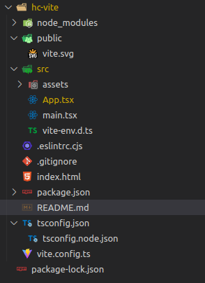
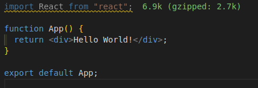
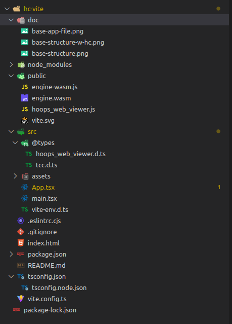
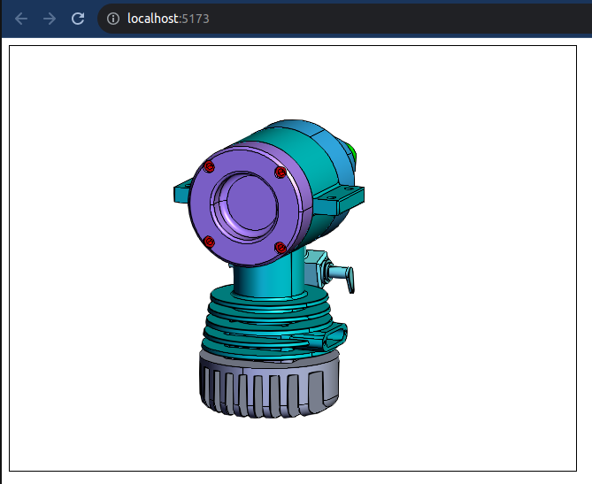

# Communicator + React + Vite

This project uses typescript but it is not mandatory. The point is just to have
the type information available and demo how to do it.

## Setup

In order to setup your project you will have to run un few commands:

```bash
npm create vite@latest # This will start an interactive CLI to pick your config

# You can skip the CLI by writing this command instead of the previous one

# Replace my project name with the name of your project

npm create vite@latest my-project-name -- --template react-ts # use 'react' as a template for non typescript project
```

Vite is incredibly fast to setup your project because it does not run the
install commands.  
So in order to have everything installed get into the newly created directory
and run the install command

```bash
cd my-project-name

npm install # or simply 'npm i'
```

While this is installing you can go in the directory with your editor and start
removing the files we won't need, basically the CSS files  
It should look something like this:  


Now let's clean the App.tsx file to make it as simple as possible:  


> Do not forget to remove the reference to index.css in your `main.tsx` file.

Finally, once your installation is done you can run this command to see if
everything is working fine:

```bash
npm run dev # This will start a development server running your app
```

## Adding HOOPS Communicator

Now let's add Communicator to the project.  
First let's add the files that we need into the project as public assets:  


> As you can see we've added the d.ts files for typescript but they could be
> script if you do not use typescript

### Adding type declaration

> This section can be skipped for non typescript user

First lets add the @types folder to our tsconfig file:

```json
{
  "compilerOptions": {
    "target": "ES2020",
    "useDefineForClassFields": true,
    "lib": ["ES2020", "DOM", "DOM.Iterable"],
    "module": "ESNext",
    "skipLibCheck": true,

    /* Bundler mode */
    "moduleResolution": "bundler",
    "allowImportingTsExtensions": true,
    "resolveJsonModule": true,
    "isolatedModules": true,
    "noEmit": true,
    "jsx": "react-jsx",

    /* Linting */
    "strict": true,
    "noUnusedLocals": true,
    "noUnusedParameters": true,
    "noFallthroughCasesInSwitch": true,
    "typeRoots": ["src/@types", "node_modules/**"] // This adds the types directory
  },
  "include": ["src"],
  "references": [{ "path": "./tsconfig.node.json" }]
}
```

Then let's add the declarations to vite environment:

```typescript
// src/vite-env.d.ts

/// <reference types="vite/client" />
/// <reference path="@types/hoops_web_viewer.d.ts" />
/// <reference path="@types/tcc.d.ts" />
```

Now vite should be able to extract type information for our project and our IDE
should recognize Communicator types and functions and provide autocompletion and
documentation hints

### Adding the webviewer code

Simply add a script tag referencing hoops_web_viewer.js to your HTML page:

```html
<!DOCTYPE html>
<html lang="en">
  <head>
    <meta charset="UTF-8" />
    <link rel="icon" type="image/svg+xml" href="/vite.svg" />
    <meta name="viewport" content="width=device-width, initial-scale=1.0" />
    <title>Vite + React + TS</title>
    <!-- Let's add the WebViewer -->
    <script type="text/javascript" src="hoops_web_viewer.js"></script>
  </head>
  <body>
    <div id="root"></div>
    <script type="module" src="/src/main.tsx"></script>
  </body>
</html>
```

At this point your application is ready to embed a viewer.

## Add a WebViewer to your App

Now that the setup and configuration is done, you should be good to go.
Let's keep it simple and reproduce the first step of the
[Hello Web Viewer example](https://docs.techsoft3d.com/communicator/latest/tutorials/basic-app/hello-web-viewer.html).

In your App.tsx file add the following code:

```tsx
import React, { useEffect, useRef } from "react";

function App() {
  const viewerRef = useRef<HTMLDivElement | null>(null);
  const hwvRef = useRef<Communicator.WebViewer | null>(null);

  useEffect(() => {
    if (!viewerRef.current || hwvRef.current) {
      return;
    }

    const hwv = new Communicator.WebViewer({
      container: viewerRef.current,
      endpointUri: "microengine.scs",
    });

    hwv.start();

    hwvRef.current = hwv;
  });

  return (
    <div
      ref={viewerRef}
      style={{
        width: 640,
        height: 480,
        position: "relative",
        border: "solid 1px black",
      }}
    ></div>
  );
}

export default App;
```

And this is what your app should look like now:  

